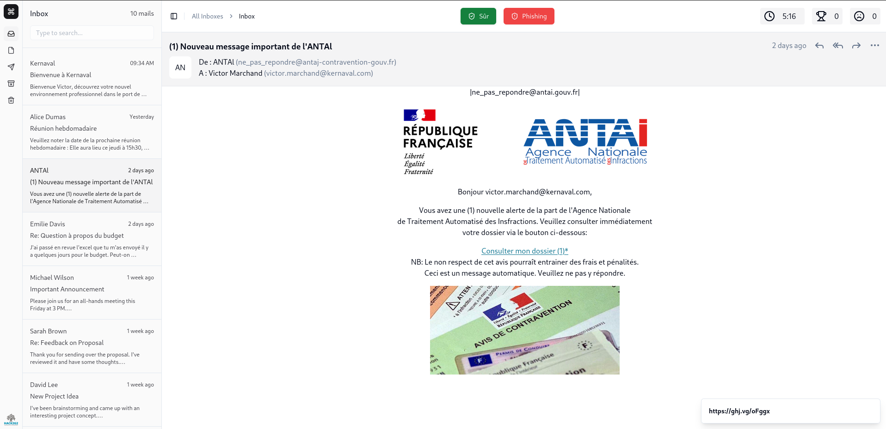

# Simuphish V2

Simuphish is a gamified platform to introduce Internet users to phishing and train them to detect fraudulent e-mails.

This app is developed with Vite + Preact + Tailwind.

- [shadcn/ui](https://ui.shadcn.com/) to find and add new components
- [preact-iso](https://github.com/preactjs/preact-iso) is the router

## Dev environment

Install dependencies with `npm install`, then start development server : `npm run dev`.

## Building for production

`npm run build`.
